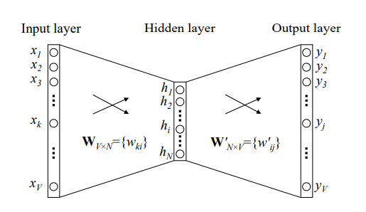

Word2Vec Implementation With Numpy
====

First thing's first, this can never be a tutorial nor an example code. It's just a personal attempt to implement Word2Vec. Bugs and low efficiencies can be found everywhere in my code so both your advice and opinions are well welcomed here. Hope it will get you to understand or at least give you the glimpse of the mechanism behind it all. :D

References 
----
- The paper that started it all:

https://arxiv.org/pdf/1301.3781.pdf

Mikolov T, Chen K, Corrado G, et al. Efficient estimation of word representations in vector space[J]. arXiv preprint arXiv:1301.3781, 2013.

- The paper that gives the best explanation ever(my favorite):
  
https://arxiv.org/pdf/1411.2738.pdf 

Rong X. word2vec parameter learning explained[J]. arXiv preprint arXiv:1411.2738, 2014. 

Environment
----
I'm using **Numpy**, **jieba**(for word segmentation), **re**(regular expression for leaving out all the non-Chinese characters) and **zhconv**(for turning traditional Chinese into simplified Chinese if necessary). 

Overall
----
Word2Vec takes a large corpus represented by one-hot encoding as input, and produces the output after two neural nerwork layers.

As is shown above, both input and output vectors are in R^V and the vectors in the hidden layer are in R^N. Obviously, V is much larger than N, which is exactly the drawback of the one-hot encoding, too much dimensionality and too little semantic information.

The goal is to get the first weight matrix, each row of which represents the final vector for the corresponding word. Remember, in this little neural network, what really matters is the first weight matrix instead of the output layer because this network doesn't have to predict anything. 

There are two basic training strategies, CBOW and skip-gram. In this demostration, I'm focusing on CBOW, which uses the context words to calculate the central word.

